### Introduction:
In this tutorial, we'll learn the fundamentals of Pods, the smallest deployable units in the Kubernetes ecosystem. Using Meshery Playground, an interactive live cluster environment, we'll perform hands-on labs to gain practical experience in deploying, managing, and understanding some of the concepts related to Pods.

### Prerequisites:
- Basic understanding of containerization and Kubernetes concepts.
- Access to the _Meshery Playground_. If you don't have an account, sign up at [Meshery Playground](https://meshery.layer5.io/).

### Lab Scenario:
Deploy and explore an NGINX pod in a Kubernetes cluster.

### Objective:
Learn how to create, manage, and explore Kubernetes Pods within the context of a microservices architecture.

### Steps:

#### Access Meshery Playground
   - Log in to the [Meshery Playground](https://meshery.layer5.io/) using your credentials. On successful login, you should be at the dashboard. Press the **X** on the _Where do you want to start?_ popup to close it (if required).
   - Click **Explore** in the Cloud Native Playground tile to navigate to _MeshMap_.

#### Create a simple stand-alone Pod
   1. In the MeshMap screen, rename _Untitled Design_ to a name of choice. This helps in identifying the design later.
   2. Click **Components** tab
   3. search for **Pod** in the list of components.
      
   4. Scroll down, _select and drag_ the **Pod** component from the search results to the design canvas on the right.
      
   5. You should now have a pod in the design canvas for further configuration. It has a default name assigned to it.
      Click the pod icon (in circle) to load the configuration modal.
   6. Rename the pod, if necessary, for easier identification later.
      
   
#### Add a container to the Pod
The pod at this stage does not have a container, so we add one. This is similar to defining the containers in the _spec:_ section of a YAML file. For this hands-on we will do some basic necessary configurations only.

   7. Scroll down within the Pod configuration modal to the Containers section. Click **+** to add a container.
      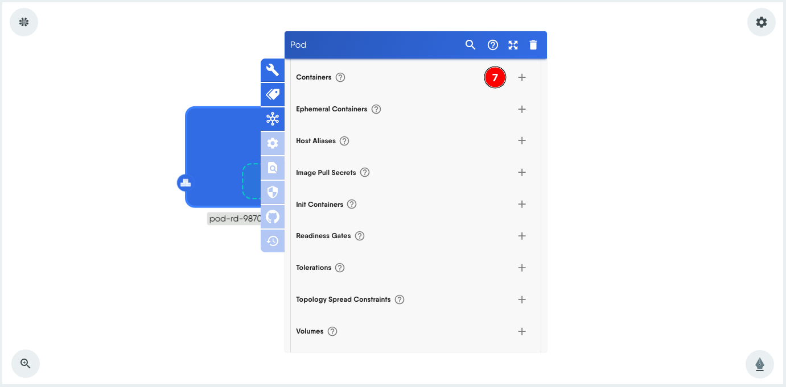
   8. Expand Containers-0
      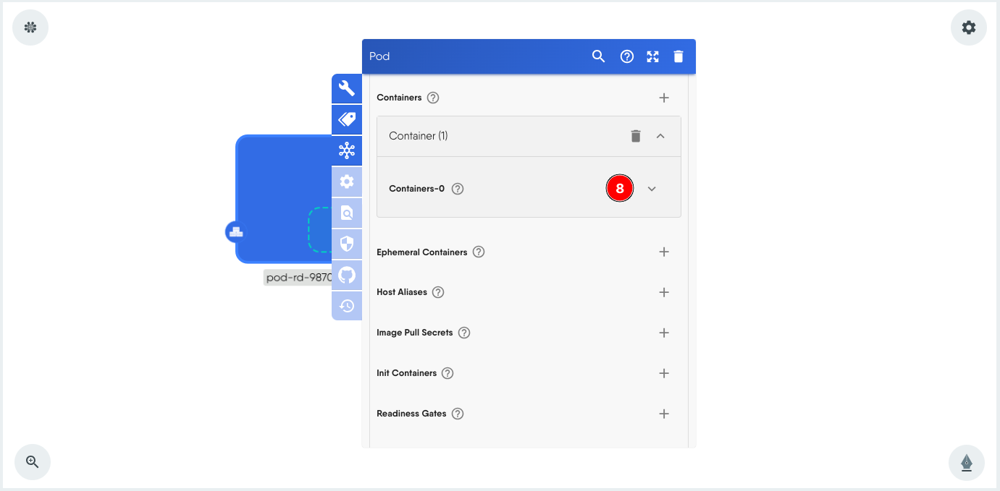
   9. Next, fillout some of the requred container specifications. Start by entering the container image, we will use _nginx:latest_ for this exercise.
   10. Give the container a name.
       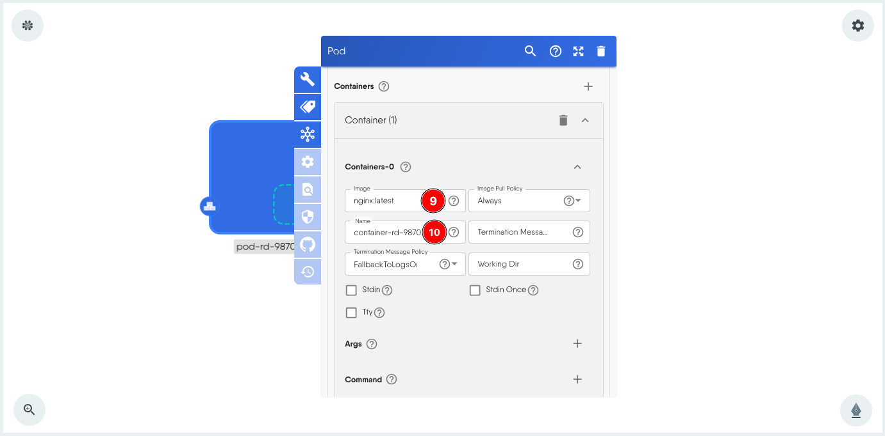 
   11. Additionally, we will also give it a label. This will server many advantages later in this exercise. Click the label icon.
   12. Click **+** next to _Labels_. 
   13. Set any label of choice. Give a unique label.
       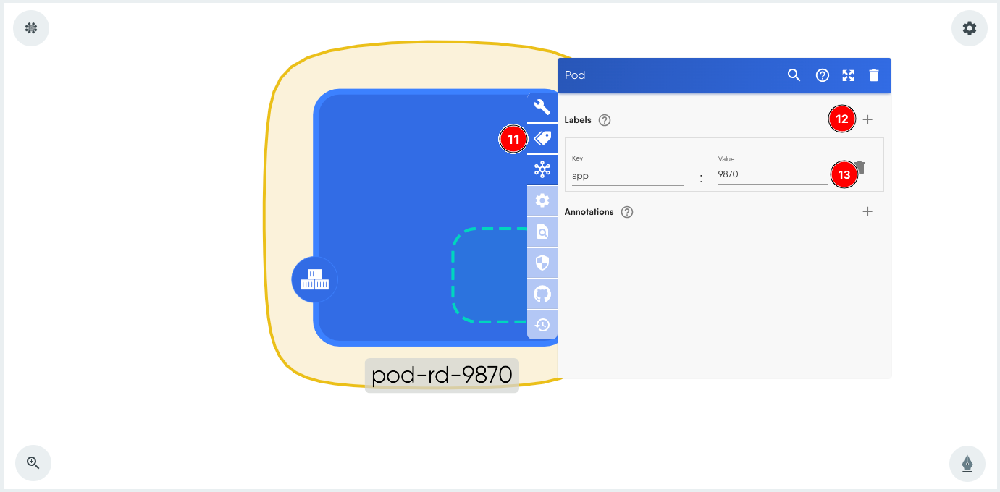
   12. Click outside to close the modal.

#### Validating and Deploying the Pod
The next step in this process is to validate the design and then we are ready to deploy. 

To do this, click **Validate** on the top. 

This should show a pop-up with the number of components, annotations and errors (if any).
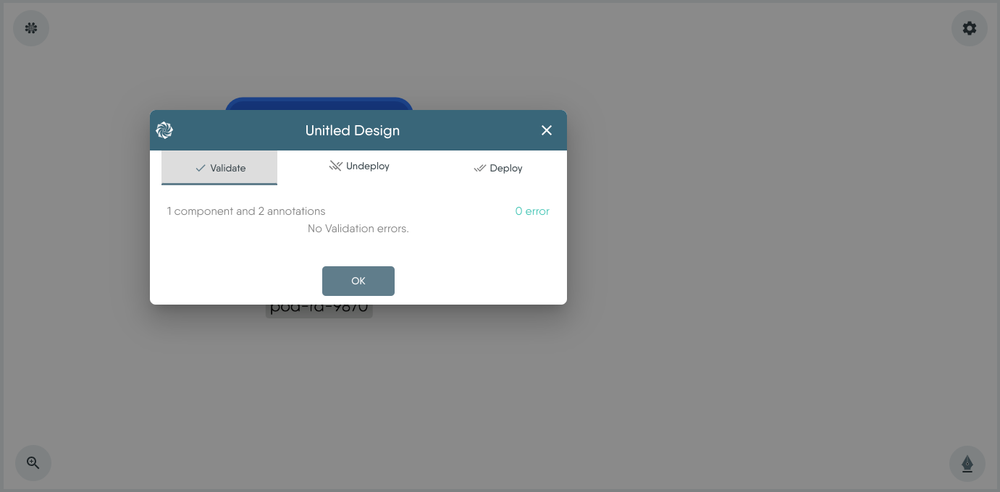

Ensure there are no errors before deploying. To deploy, click the **Deploy** (1) tab in the pop-up modal and then click **Deploy** (2) again.

You should see a few alerts on the bottom right about the deployment.

#### Visualizing the Pod
To view the resources deployed we will use the **Visualize** section of the MeshMap. A view is created with necessary filters to show the relevant resources.
 1. Click Visualize to begin.
 2. Give the view a name.
 3. Click the filter icon.
 4. Choose appropriate filters, for this hands-on choose the label that was set earlier during the pod creation. This helps in showing limited resources in the view.

Click the filter icon again to close. This should show a filtered view with only your resources something similar to the screenshot below:
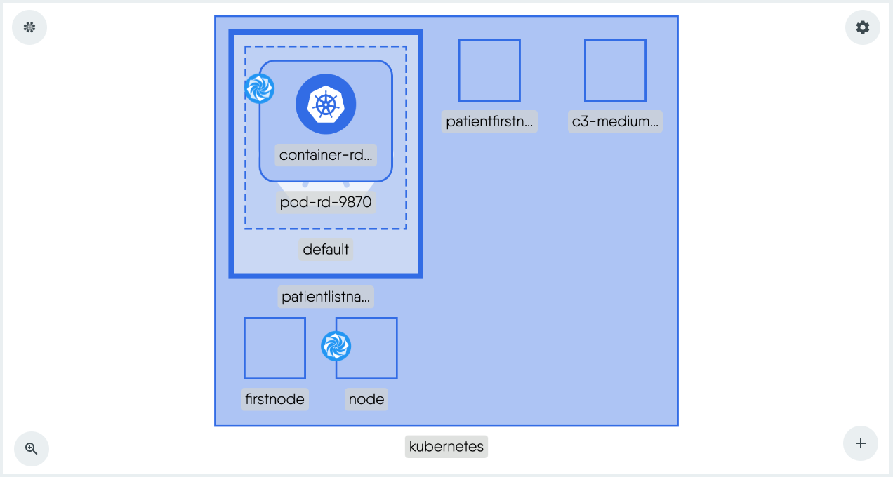

#### Pod state and information
Select the **Details** tab and select the pod from the view to view details about the pod.
The details tab shows the following:
 - Pod state, a green check means **running**.
 - The namespace where the pod is running.
 - Image details of the container in the pod like image tag and name.
 - It also shows the number of restarts and uptime.

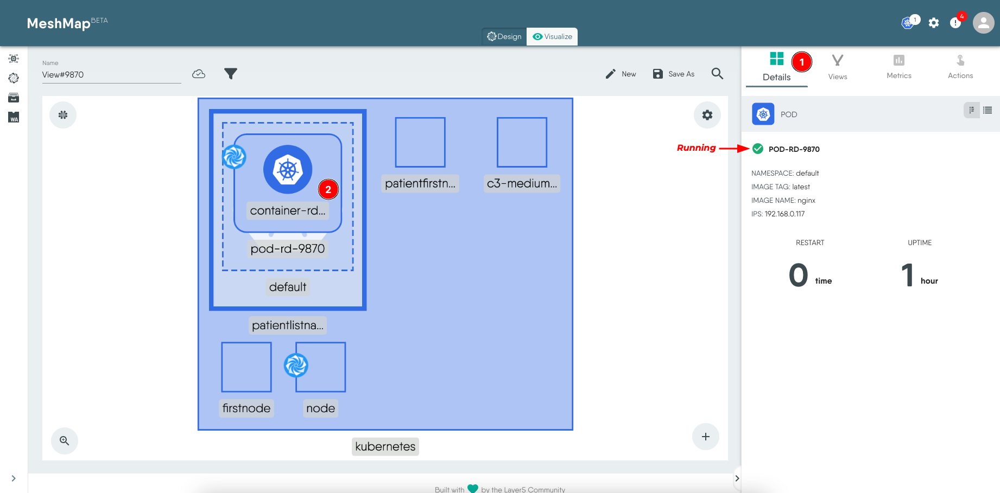

#### Connecting to the Pods / containers
Meshery Playground provides terminal capabilities to connect to the container(s) and stream logs. The following steps demonstrate this.

 1. Select the **Pod** (or container). If you have multiple containers in a pod, select a container.
 2. Select the **Actions** tab to the right.
 3. Click **Open Interactive Terminal**.
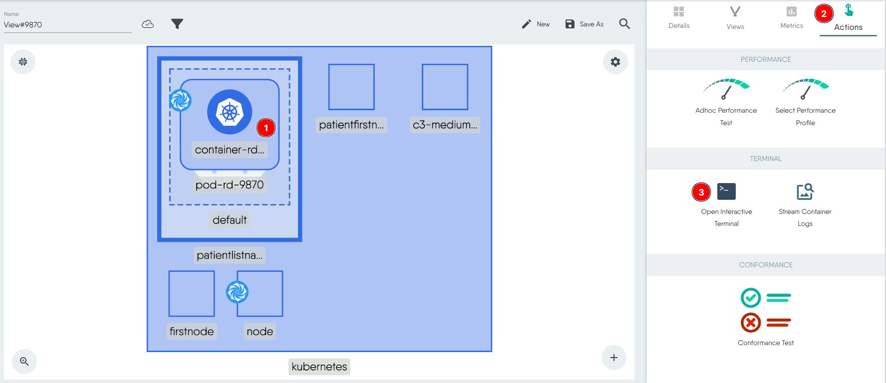
This displays the terminal on the screen.
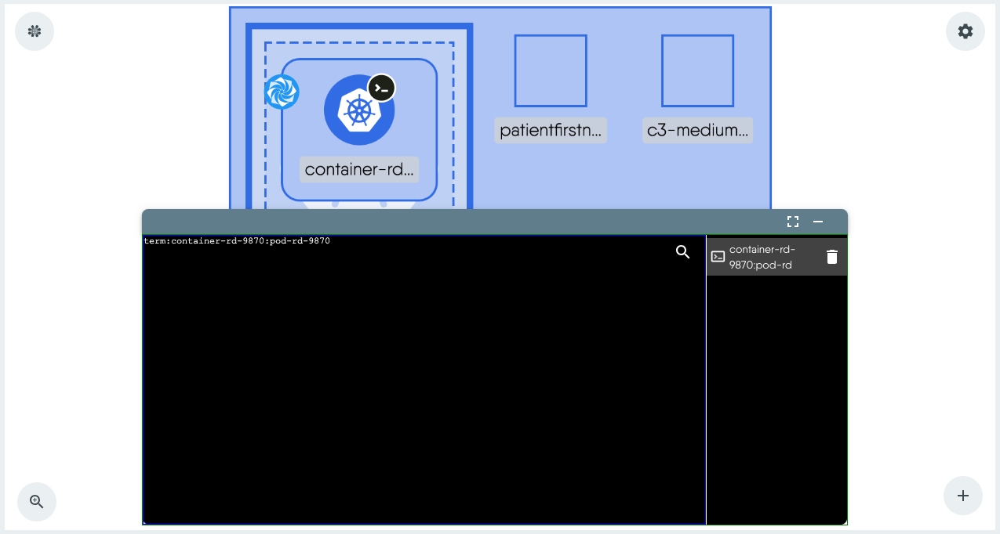
 4. To view streaming logs, click **Stream Container Logs** to the right and an additional logs view is added to the terminal window.
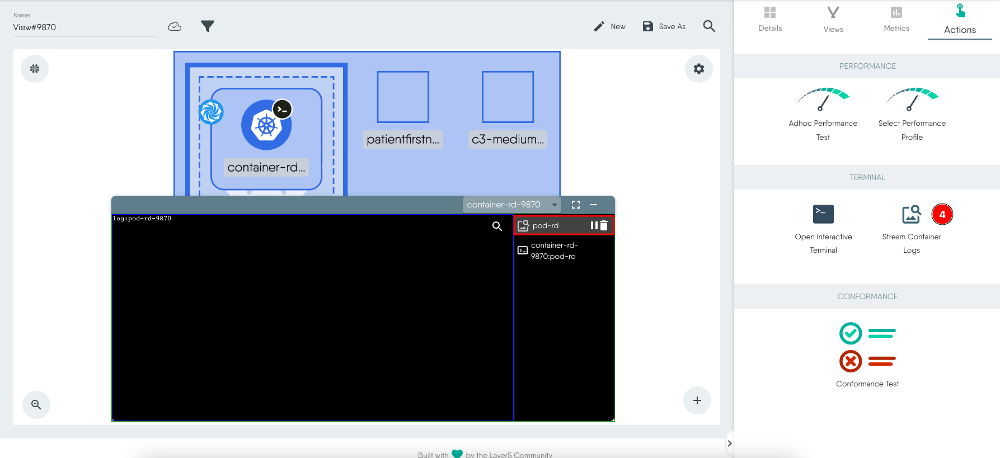

#### Exposing a Pod with a Service
> **_NOTE:_**  Meshery Playground supports only NodePort at the moment.

 1. Go back to the Design view
 2. From **Components** search for _service_ and the drag the service component to the design canvas.
 3. Click the _service_ component to load the configuration modal.
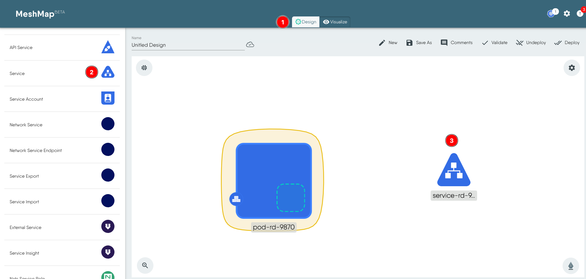
 4. Rename it if required.
 5. Change Type to NodePort for this tutorial.
 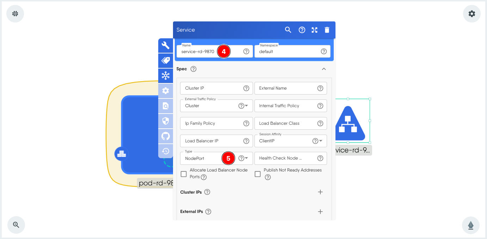
 6. Click **+** to add a Port.
 7. Expand the **Ports-0** service port to make changes.
 
 8. For this tutorial we set the **Target Port** value to 80.
 9. We also set the **Port** value to 80.
 
 10. Click **+** next to Selector and add the key value pair **app:9870**. This is the same pair that is used as label in the Pod.
 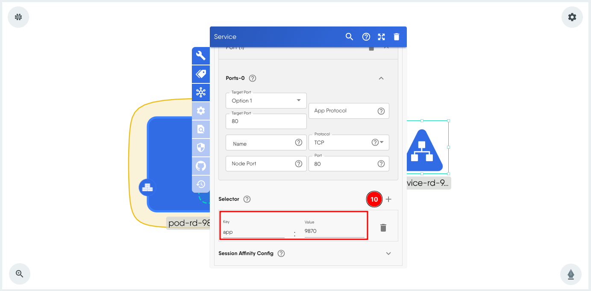
 11. Finally label this service too, with the same key value pair. This also helps in filtering resources specific to us in the Visualize screen.
 
 12. Move your mouse over the service component until you see the green dots on all four sides. Move your mouse over one of the green dots to reveal an arrow, then click the arrow. Select **Network** option, and then move your mouse to the pod to create the _relationship_. It should look similar to the screenshot below:
  
 12. Validate the design. Click **Validate** from the top menu to do so.

#### Updating the deployment
In order to apply the changes or update a deployment, we must undeploy and deploy the design.

 - Select **Undeploy** and click **Undeploy** again.
 - Select **Deploy** and click **Deploy**.

#### Deleting and Recreating Pods
To delete the resources such as Pods, use the **Undeploy** option from the _Design_ view.

To recreate, use the **Deploy** option.

### Conclusion
Congratulations! You've successfully completed the lab on exploring Kubernetes Pods using Meshery Playground. This hands-on experience should have provided valuable insights into the deployment, management, and interaction with Pods in a Kubernetes environment. Continue exploring more scenarios in the Meshery Playground to enhance your skills.
