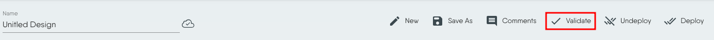

### Introduction:
In this tutorial, we'll learn the fundamentals of Pods, the smallest deployable units in the Kubernetes ecosystem. Using Meshery Playground, an interactive live cluster environment, we'll perform hands-on labs to gain practical experience in deploying, managing, and understanding some of the concepts related to Pods.

### Prerequisites:
- Basic understanding of containerization and Kubernetes concepts.
- Access to the _Meshery Playground_. If you don't have an account, sign up at [Meshery Playground](https://meshery.layer5.io/).

### Lab Scenario:
Deploy and explore an NGINX pod in a Kubernetes cluster.

### Objective:
Learn how to create, manage, and explore Kubernetes Pods within the context of a microservices architecture.

### Steps:

#### Access Meshery Playground
   - Log in to the [Meshery Playground](https://meshery.layer5.io/) using your credentials. On successful login, you should be at the dashboard. Press the **X** on the _Where do you want to start?_ popup to close it (if required).
   - Click **Explore** in the Cloud Native Playground tile to navigate to _MeshMap_.

#### Create a simple stand-alone Pod
   1. In the MeshMap screen, rename _Untitled Design_ to a name of choice. This helps in identifying the design later.
   2. Click **Components** tab
   3. search for **Pod** in the list of components.
      
   4. Scroll down, _select and drag_ the **Pod** component from the search results to the design canvas on the right.
      
   5. You should now have a pod in the design canvas for further configuration. It has a default name assigned to it.
      Click the pod icon (in circle) to load the configuration modal.
   6. Rename the pod, if necessary, for easier identification later.
      
   
#### Add a container to the Pod
The pod at this stage does not have a container, so we add one. This is similar to defining the containers in the _spec:_ section of a YAML file. For this hands-on we will do some basic necessary configurations only.

   7. Scroll down within the Pod configuration modal to the Containers section. Click **+** to add a container.
      
   8. Expand Containers-0
      
   9. Next, fillout some of the requred container specifications. Start by entering the container image, we will use _nginx:latest_ for this exercise.
   10. Give the container a name.
        
   11. Additionally, we will also give it a label. This will server many advantages later in this exercise. Click the label icon.
   12. Click **+** next to _Labels_. 
   13. Set any label of choice. Give a unique label.
       
   12. Click outside to close the modal.

#### Validating and Deploying the Pod
The next step in this process is to validate the design and then we are ready to deploy. 

To do this, click **Validate** on the top. 

This should show a pop-up with the number of components, annotations and errors (if any).

Ensure there are no errors before deploying. To deploy, click the **Deploy** (1) tab in the pop-up modal and then click **Deploy** (2) again.

You should see a few alerts on the bottom right about the deployment.

#### Visualizing the Pod
To view the resources deployed we will use the **Visualize** section of the MeshMap. A view is created with necessary filters to show the relevant resources.
 1. Click Visualize to begin.
 2. Give the view a name.
 3. Click the filter icon.
 4. Choose appropriate filters, for this hands-on choose the label that was set earlier during the pod creation. This helps in showing limited resources in the view.

Click the filter icon again to close. This should show a filtered view with only your resources something similar to the screenshot below:

#### Pod state and information
Select the **Details** tab and select the pod from the view to view details about the pod.
The details tab shows the following:
 - Pod state, a green check means **running**.
 - The namespace where the pod is running.
 - Image details of the container in the pod like image tag and name.
 - It also shows the number of restarts and uptime.

### Conclusion
Congratulations! You've successfully completed the lab on exploring Kubernetes Pods using Meshery Playground. This hands-on experience should have provided valuable insights into the deployment, management, and interaction with Pods in a Kubernetes environment. Continue exploring more scenarios in the Meshery Playground to enhance your skills.
